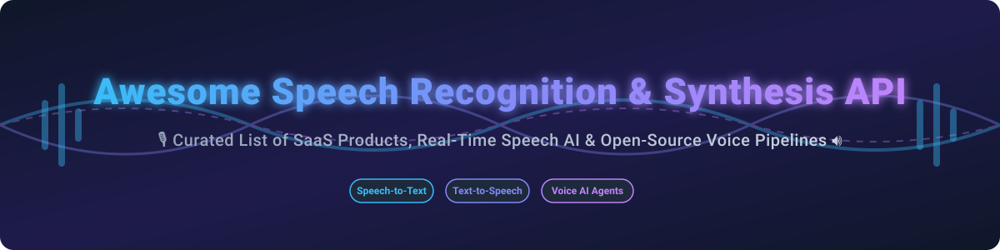

# Awesome Speech Recognition & Synthesis API 🎙️⚡

  

  
  
  
  
  
  

---

## 🌟 Top Speech Recognition & Synthesis API Ecosystem

**Curated List of Commercial SaaS Products & Open-Source GitHub Projects**  
*Focused on Speech-to-Text (STT/ASR), Text-to-Speech (TTS), Voice AI Agents, Audio Intelligence & Real-Time Voice Pipelines* 🗣️🚀

**Last updated: October 2026** 📅

This repository tracks notable **commercial speech APIs** and **open-source projects** that convert speech to text, synthesize natural-sounding audio, and orchestrate complete voice agent pipelines. These tools power transcription services, voice assistants, accessibility features, interactive voice response (IVR), and conversational AI applications.

---

## 📑 Table of Contents

- [☁️ SaaS / Hosted Speech Platforms](#-saas--hosted-speech-platforms)
- [🔓 Open-Source GitHub Projects](#-open-source-github-projects)
  - [🎙️ Speech-to-Text (STT / ASR)](#️-speech-to-text-stt--asr)
  - [🔊 Text-to-Speech (TTS)](#-text-to-speech-tts)
  - [🤖 Voice Agent Orchestration](#-voice-agent-orchestration)
  - [🛠️ Additional Open-Source Speech Tools](#️-additional-open-source-speech-tools)
- [🤝 How to Contribute](#-how-to-contribute)
- [💖 Support & Sponsorship](#-support--sponsorship)
- [⚠️ Disclaimer](#️-disclaimer)
- [⭐ Star History](#-star-history)

---

## ☁️ SaaS / Hosted Speech Platforms

### 📊 Market Dynamics & Industry Overview

> 💡 **Market Size & Structure**: The global Speech and Voice Recognition market size is estimated at **$18.2 Billion in 2026** (projected to reach ~$45B+ by 2032 with a ~19.5% CAGR). The market structure is **moderately fragmented**: hyper-scale cloud incumbents (Google Cloud, Microsoft Azure, AWS) dominate high-volume enterprise infrastructure, while specialized voice AI category leaders (ElevenLabs, Deepgram, AssemblyAI) capture high-growth Developer & AI Voice Agent workloads through hyper-optimized streaming latency, domain accuracy, and zero-shot voice cloning capabilities.

Below is the comparison of top commercial Speech-to-Text (STT) and Text-to-Speech (TTS) SaaS platforms sorted by company valuation/revenue in descending order:

| Platform 🏢 | Valuation / Est. Annual Revenue 💰 | Starting Tier Pricing 💵 | Free Tier / Trial Limits 🎁 | Primary Strengths & Key Features 🚀 |
| :--- | :--- | :--- | :--- | :--- |
| **[Google Cloud Speech-to-Text](https://cloud.google.com/speech-to-text)** 🌐 | **$2.1 Trillion** (Alphabet MCap) / ~$35B+ Cloud Rev | **$0.016 / minute** (Standard STT v1/v2) | **60 minutes free / month** (recurred indefinitely for STT) | 125+ languages, speaker diarization, automatic punctuation, native Google Cloud ecosystem integration. |
| **[Microsoft Speech Service](https://azure.microsoft.com/en-us/products/ai-services/speech-to-text)** 🔷 | **$3.1 Trillion** (MSFT MCap) / ~$110B+ Cloud Rev | **$1.00 / hour** ($0.0166/min for STT); **$4.00 / 1M chars** (Neural TTS) | **5 audio hours STT & 0.5M characters Neural TTS free / month** | 100+ language support, custom model training, enterprise compliance, Azure AI infrastructure integration. |
| **[AWS Transcribe](https://aws.amazon.com/transcribe/)** ☁️ | **$1.9 Trillion** (Amazon MCap) / ~$105B+ AWS Rev | **$0.024 / minute** (First 250,000 mins/month) | **60 minutes free / month** for 12 months (AWS Free Tier) | AWS-native integration, streaming & batch modes, custom vocabulary, speaker diarization. |
| **[ElevenLabs](https://elevenlabs.io/)** 🎙️ | **$3.3 Billion** Valuation / ~$100M+ ARR | **$5.00 / month** (Starter plan; $0.30 / 1k characters on scale) | **10,000 characters / month** forever (free tier with attribution) | Gold standard for voice cloning fidelity, emotional expression, sub-75ms TTFA inference latency. |
| **[AssemblyAI](https://www.assemblyai.com/)** ⚡ | **$300 Million** Valuation / ~$30M+ ARR | **$0.37 / hour** ($0.00616/min for Universal-1) | **$50 free credit** upon sign-up (approx. ~135 hours of transcription) | Universal-3.5 Pro Realtime streaming, self-hosted containers (48 streams/instance), enterprise compliance & GovCloud. |
| **[Deepgram](https://deepgram.com/)** ⚡ | **$250 Million** Valuation / ~$25M+ ARR | **$0.0043 / minute** (Pay-As-You-Go Nova-2 STT); **$0.0077 / minute** (Nova-3 Streaming) | **$200 free credit** upon sign-up (valid for 1 year, ~45,000 minutes) | Sub-300ms streaming latency, Nova-3 STT model, bundled voice agent stack with Flux end-of-turn detection. |
| **[Speechmatics](https://www.speechmatics.com/)** 🎯 | **$150 Million** Valuation / ~$20M+ ARR | **$0.0085 / minute** ($0.51/hour for Standard ASR) | **4 hours free audio / month** (recurring) | Real-time enterprise speech recognition, exceptional multi-accent accuracy, on-prem container deployment. |
| **[Rev.ai](https://www.rev.ai/)** 📝 | **$100 Million** Valuation / ~$15M+ ARR | **$0.02 / minute** ($1.20/hour for Automated Speech Recognition) | **5 hours free transcription** on initial sign-up | High-accuracy automated ASR, seamlessly backed by professional human transcription fallback. |
| **[PlayHT](https://play.ht/)** 🔊 | **$40 Million** Valuation / ~$8M+ ARR | **$31.20 / month** (Creator plan, 3M characters/year) | **12,500 characters free** single allocation (non-commercial use) | Real-time conversational voice synthesis, instant voice cloning, low-latency audio streaming. |

---

## 🔓 Open-Source GitHub Projects

Speech processing represents one of the strongest open-source AI ecosystems. The projects below are sorted by their GitHub star count in descending order ⭐.

### 🎙️ Speech-to-Text (STT / ASR)

- **[OpenAI Whisper](https://github.com/openai/whisper)**  🌟 **109.9k+ Stars**  
  **The de facto open-source STT reference model**, MIT licensed. Multilingual (~99 languages) with `large-v3` achieving ~7.4% average WER. Model weights and code are fully MIT. The `large-v3-turbo` model (809M parameters) runs ~8× faster than original PyTorch release.

- **[whisper.cpp](https://github.com/ggml-org/whisper.cpp)**  🌟 **54.1k+ Stars**  
  **High-performance C/C++ port of Whisper** built on the ggml tensor library. Lightweight, CPU-only execution with zero Python dependencies. Optimized for ARM, Apple Silicon (Core ML), and desktop embedding.

- **[faster-whisper](https://github.com/SYSTRAN/faster-whisper)**  🌟 **25.7k+ Stars**  
  **CTranslate2 reimplementation of Whisper** delivering up to 4× speedup over the reference implementation with lower GPU memory footprint. Drop-in Python library for production transcription servers.

- **[WhisperX](https://github.com/m-bain/whisperX)**  🌟 **24.3k+ Stars**  
  **Whisper + pyannote speaker diarization + wav2vec2 forced alignment**. Provides exact word-level timestamp alignment and speaker label attribution out of the box.

- **[NVIDIA Parakeet (NeMo)](https://github.com/NVIDIA/NeMo)**  🌟 **18.5k+ Stars**  
  **State-of-the-art English & Multilingual ASR**. Parakeet TDT 0.6B achieves ~6.05% WER on Open ASR Leaderboard, outperforming Whisper large-v3 on English while running up to 10× faster.

- **[Vosk ASR](https://github.com/alphacep/vosk-api)**  🌟 **15.1k+ Stars**  
  **Offline, lightweight speech recognition toolkit**. Supports 50+ languages on mobile (Android, iOS), Raspberry Pi, and desktop apps with streaming partial results and tiny 50MB models.

- **[sherpa-onnx](https://github.com/k2-fsa/sherpa-onnx)**  🌟 **15.1k+ Stars**  
  **Multi-platform ONNX-based speech suite**. Offline & streaming STT, TTS, speaker recognition, and VAD across Linux, macOS, Windows, Android, iOS, and embedded devices.

- **[Moonshine](https://github.com/UsefulSensors/moonshine)**  🌟 **11.1k+ Stars**  
  **Ultra-fast speech recognition for edge devices**. Optimized for resource-constrained hardware (Raspberry Pi, mobile) with ~5× lower latency on short audio clips than Whisper.

- **[Distil-Whisper](https://github.com/huggingface/distil-whisper)**  🌟 **4.1k+ Stars**  
  **Distilled, 6× faster version of Whisper** with 49% fewer parameters, retaining within ~1% Word Error Rate (WER) of `large-v3` on English audio.

- **[Kyutai STT](https://github.com/kyutai-labs/delayed-streams-modeling)**  🌟 **3.0k+ Stars**  
  **Real-time streaming ASR with semantic VAD built-in**. Detects end-of-turn by sentence meaning rather than silence pauses. Handles ~400 concurrent streams per GPU.

---

### 🔊 Text-to-Speech (TTS)

- **[Fish Speech](https://github.com/fishaudio/fish-speech)**  🌟 **32.9k+ Stars**  
  **Leading open-source TTS model (Elo 1128 on TTS Arena)**. Features 5B parameters, 80+ language capabilities, fine-grained emotional control via 15,000+ prosody tags, and sub-100ms TTFA streaming.

- **[Chatterbox (Resemble AI)](https://github.com/resemble-ai/chatterbox)**  🌟 **26.7k+ Stars**  
  **MIT-licensed zero-shot voice cloning with expressivity tags** (laughing, sighing, emphasis). Supports 23+ languages and sub-200ms generation via Chatterbox Turbo.

- **[SWivid F5-TTS](https://github.com/SWivid/F5-TTS)**  🌟 **15.3k+ Stars**  
  **Non-autoregressive flow-matching zero-shot voice cloning**. Generates natural speech from short reference audio clips. *(Note: Code MIT, weights CC-BY-NC)*.

- **[Sesame CSM-1B](https://github.com/SesameAILabs/csm)**  🌟 **14.7k+ Stars**  
  **Real-time conversational speech model** built on Llama backbone + Mimi audio codec for fluid, natural human-agent dialogues. Apache-2.0 licensed.

- **[Kokoro-82M](https://github.com/hexgrad/kokoro)**  🌟 **9.1k+ Stars**  
  **Ultra-lightweight 82M parameter English TTS model**. Runs GPU-free on standard CPUs with exceptional quality for its size. Apache-2.0 licensed.

- **[Orpheus-TTS](https://github.com/canopyai/Orpheus-TTS)**  🌟 **6.3k+ Stars**  
  **Apache-2.0 licensed 3B parameter TTS model** designed for production audiobook generation, long-form narration, and voice agent integration.

- **[Kyutai Pocket TTS](https://github.com/kyutai-labs/delayed-streams-modeling)**  🌟 **3.0k+ Stars**  
  **Delayed-streams speech synthesizer (1.6B & 100M Pocket variants)**. Enables real-time CPU streaming audio generation while LLM tokens are generated.

---

### 🤖 Voice Agent Orchestration

- **[Pipecat](https://github.com/pipecat-ai/pipecat)**  🌟 **16.1k+ Stars**  
  **Open-source Python framework for building voice AI agents**. Delivers sub-1000ms E2E latency with seamless multi-provider adapters for STT, LLM, and TTS pipelines.

- **[LiveKit Agents](https://github.com/livekit/agents)**  🌟 **14.5k+ Stars**  
  **WebRTC voice agent framework**. Connects real-time AI agents directly to WebRTC media sessions with ~750-900ms E2E latency and turn-taking controls.

- **[Speaches](https://github.com/speaches-ai/speaches)**  🌟 **3.6k+ Stars**  
  **"Ollama for Audio"** — self-hosted API server providing OpenAI-compatible speech endpoints with automatic GPU model loading/unloading.

- **[Kyutai Unmute](https://github.com/kyutai-labs/unmute)**  🌟 **1.5k+ Stars**  
  **Reference voice agent architecture** combining Kyutai STT + LLM + Kyutai TTS for full sub-500ms conversational turn-taking on a single GPU.

- **[omnivoice](https://github.com/plexusone/omnivoice-core)**  🌟 **2 Stars**  
  **Go framework with unified interfaces** for STT, TTS, real-time voice providers, barge-in detection, MCP servers, and subtitle formatting.

---

### 🛠️ Additional Open-Source Speech Tools

- **[pyannote.audio](https://github.com/pyannote/pyannote-audio)**  🌟 **10.6k+ Stars** — The benchmark open-source toolkit for speaker diarization, voice activity detection (VAD), and overlap detection.
- **[Voxtral Mini 3B](https://github.com/mistralai/voxtral-mini-3b)** — Mistral AI's native speech-text multimodal model for transcription, translation, and audio QA. Apache-2.0.
- **[Superwhisper S1-mini](https://github.com/superwhisper/s1-mini)** — 484MB 0.6B local model specialized in cleaning raw ASR output (fixing stutters, filler words, and punctuation).

---

## 🤝 How to Contribute

1. Fork the repository 🍴
2. Add/edit entries in `README.md` following the standardized table or bullet format ✍️
3. Include: Project name, official website/repository URL, short description, and pricing/star metadata 📌
4. Submit a Pull Request with a clear summary of additions 🚀

---

## 💖 Support & Sponsorship

Thank you for visiting this repository! If you find this curated list of speech recognition, text-to-speech, and voice AI resources helpful, please consider supporting the project:

- ⭐ **Star** this repository on GitHub to show your appreciation and help others discover it.
- 🍴 **Fork** it to keep your own reference copy or contribute new speech APIs & tools.
- 📢 **Share** it with fellow voice AI developers, engineers, and researchers!
- ☕ **Buy me a coffee / Sponsor**: If you'd like to support ongoing maintenance and research, feel free to sponsor via the [GitHub Sponsors Dashboard](https://github.com/sponsors/ishandutta2007).

---

## ⚠️ Disclaimer

- This list is **community-curated** for developer reference — not an endorsement ℹ️
- **Data Privacy**: Speech APIs handle voice data. Ensure GDPR/CCPA compliance and verify whether commercial APIs use submitted audio for model training 🔒
- **License Traps**: Verify pre-trained weight licenses before commercial deployment (e.g., F5-TTS weights are CC-BY-NC; Fish Speech requires commercial licensing) 📜

---

## 📈 Star History

---

  <b>Made with ❤️ for voice AI engineers, speech researchers, and conversational AI developers.</b>

